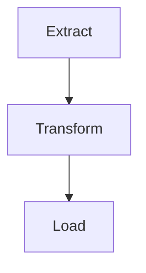
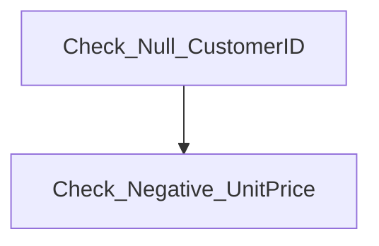

# DAG Architecture

This project has two DAGs:

## 1. `etl_pipeline_full` DAG

- **Extract**: Load and clean CSV data
- **Transform**: Build dimension tables and fact table (star schema)
- **Load**: Load all transformed tables into DuckDB

## 2. `data_quality_check` DAG

- **Check_Null_CustomerID**: Verifies no NULLs in `CustomerKey`
- **Check_Negative_UnitPrice**: Ensures no negative unit prices in FactSales